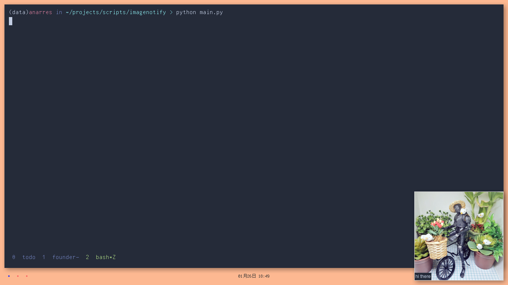

simple example of an image notification with the features:

- left-click to dismiss
- right-click to open the associated url
- auto-dismiss after a timeout (default 5s)

only requirements are python3 and pillow (`pip install pillow`).

